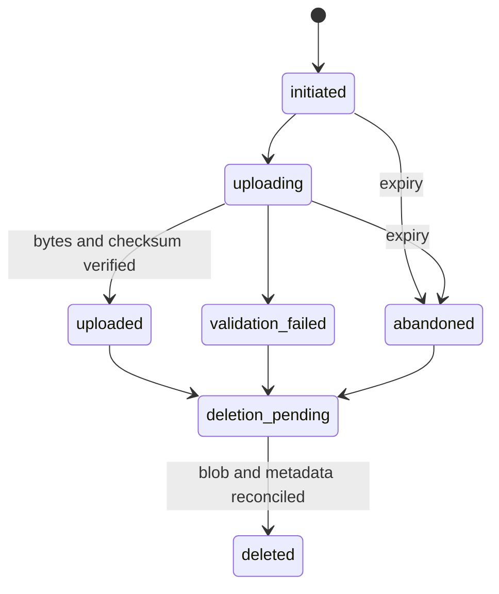
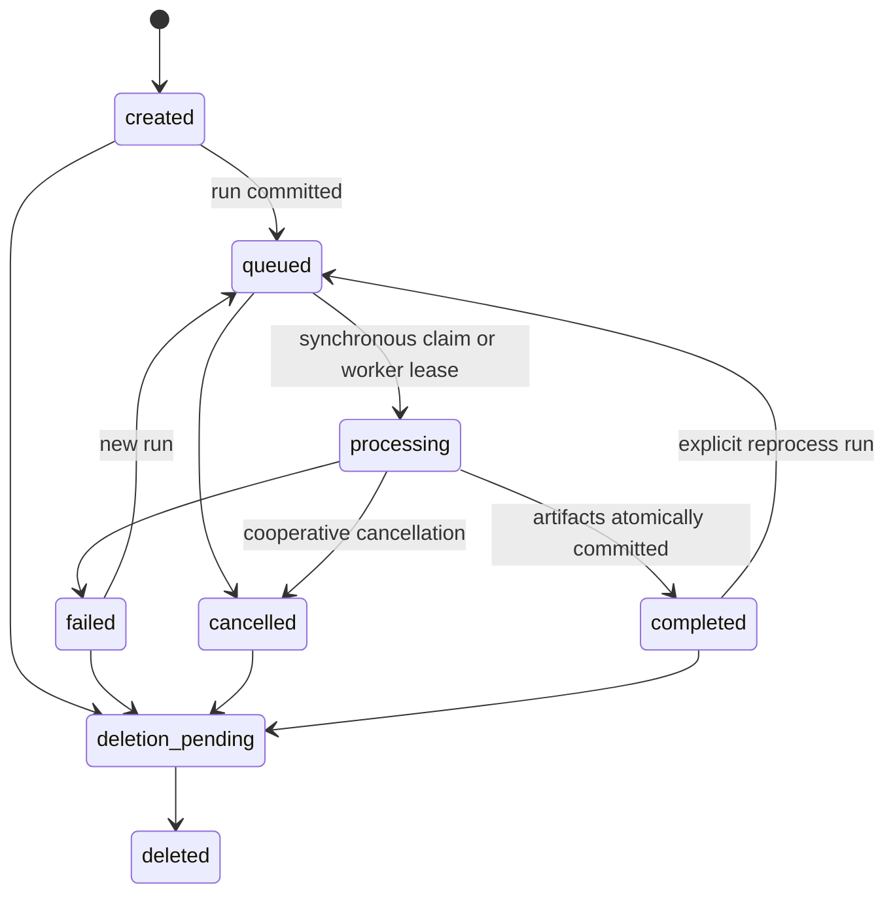

# Concurrency, Idempotency, and Write Safety

## Transaction boundaries

Each command has one database transaction that:

1. claims or creates its idempotency row;
2. locks or compare-and-sets the aggregate row;
3. validates ownership, account state, and the current transition;
4. writes the new current state and append-only state event;
5. records resource/response identity in the idempotency row;
6. commits before external work begins.

Blob transfer and video analysis cannot be held inside a database transaction.
Their completion uses a second transaction that verifies the expected row version,
storage checksum/status, and processing claim before committing metadata.

## Idempotency contract

All POST/DELETE commands that create work or mutate review state accept
`Idempotency-Key` (128 bytes maximum, random UUID recommended). Store only a
SHA-256 hash.

- Same user + scope + key + request fingerprint returns the original status/resource.
- Same key with a different fingerprint returns `409 idempotency_key_reused`.
- `in_progress` returns `409 command_in_progress` plus resource/location where safe.
- Retryable infrastructure failure permits the same key to resume.
- Validation/authorization failure is not stored before authentication and ownership
  are resolved; final domain failure may be stored briefly.
- Keys expire no sooner than 24 hours; upload/analysis creation keys should remain
  seven days for mobile/client retry tolerance.

The UI disables duplicate controls, but database uniqueness is the authority.

## Duplicate handling

- Duplicate upload bytes: a new intent with the same SHA-256 is looked up only
  within one owner and returns the existing analysis. Do not globally deduplicate
  private bytes.
- Duplicate analysis request: fingerprint canonical analysis options, source video
  hash, and requested pipeline bundle. A partial unique index prevents two active
  identical analyses for one owner/video.
- Double-click on a stage command: same idempotency key returns the command result;
  different keys encounter the state/active-run constraint.
- Retry after failure: create a new `AnalysisRun` with incremented `run_number`;
  never reuse or mutate the failed run's evidence.

Upload idempotency is evaluated before duplicate detection. The web upload flow
creates a key per intent, reuses it across retries, and creates a new key for a
new file selection or Analyze Again. An owner-and-checksum-scoped PostgreSQL
advisory lock makes concurrent identical uploads converge on one initial
analysis, while different owners remain independent. Analyze Again explicitly
bypasses duplicate suppression and preserves the earlier analysis.

Detection is byte-exact. Re-encoded or otherwise modified videos are new uploads;
perceptual fingerprinting is future work. See
[Exact Duplicate Video Detection](EXACT_DUPLICATE_VIDEO_DETECTION.md).

## State machines

Upload state:

Analysis/run state:

The current stages remain evidence progress labels on a run:
`uploaded/inspected/calibrated/tracked/player_selected/analyzed`. They are not a
replacement for lifecycle state. Phase 1.8B may persist the current synchronous
execution by claiming the queued run in the API process immediately after commit.

Forbidden transitions include completed→processing on the same run, failed→processing
on the same run, deleted→any live state, and any transition whose expected
`row_version` is stale.

## Locking strategy

- Optimistic: normal owner edits use `update ... where id=? and row_version=?`,
  incrementing the version. Zero rows means `409 stale_resource`.
- Pessimistic: run creation, cancellation, deletion scheduling, and current-run
  promotion use `select ... for update` on Analysis.
- Worker claim later uses `for update skip locked` on queued runs, writes claimant,
  lease expiry, heartbeat, and row version, then commits.
- Unique constraints arbitrate duplicate active runs and run numbers even if two
  requests pass an early read.

## Lease and recovery

Although the queue is deferred, persist claim fields now. A worker/API executor:

- claims for a bounded lease;
- heartbeats between expensive stages;
- checks cancellation and ownership/resource deletion before each stage commit;
- may renew only its own unexpired claim via compare-and-set.

A recovery process marks an expired processing attempt `failed` with
`stale_lease`, records an event, quarantines uncommitted objects, and may enqueue a
new attempt according to retry policy. It never makes an expired run completed.

## Artifact commit

1. Write each output to a unique temporary object key.
2. Close, size, hash, and verify it.
3. Promote/copy to its immutable final key or immutable object version.
4. In one transaction create `StorageObject` and `AnalysisArtifact` metadata,
   validate expected outputs, mark the run completed, promote
   `analyses.current_run_id`, and append state events.
5. If the transaction fails, final objects are unreferenced and the orphan sweeper
   removes them after a safety window.

Readers see only `available` objects attached to a committed run. Partial output is
never added to history.

## Crash and partial-failure rules

- Database committed, execution not started: queued run remains claimable.
- Bytes uploaded, completion transaction failed: upload reconciler verifies the
  reserved key and resumes with the same idempotency key.
- Artifact bytes written, DB commit failed: mark/detect orphan; do not expose.
- DB artifact committed, object missing: quarantine run/artifact, alert, and exclude
  it from history until repaired.
- History projection failure: return a safe error; do not persist a guessed history.
