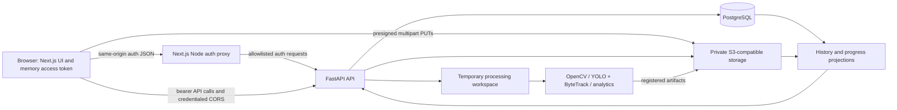
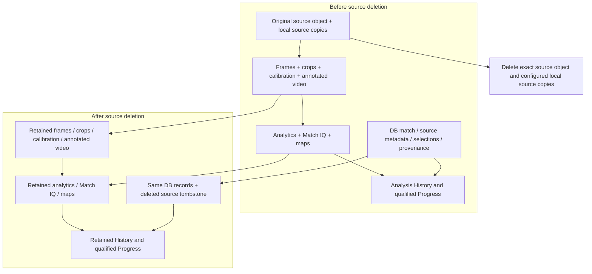
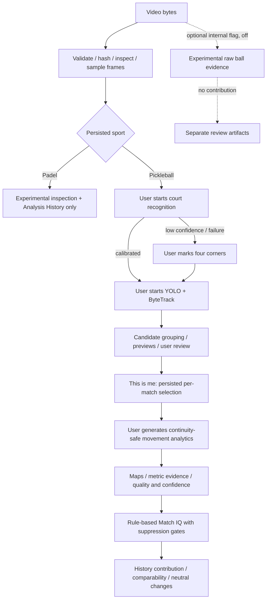
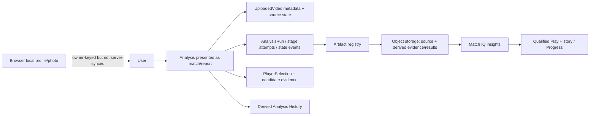

# Court4 current product, UX and engineering state audit

Investigation started: 2026-09-26; report finalized: 2026-09-28 (Asia/Singapore). Repository baseline: `25a9b86c5744bcf8d770f0caf268f5991e98a199`, Phase 1.8D3, `feat: add resilient upload recovery`. HEAD was rechecked at finalization and remains unchanged. Staging observations below were collected during the initial investigation and were not repeated on September 28.

Scope: investigation and planning only. The working tree was clean before this audit. This report is the only intended repository change. No application code, migrations, staging data, upload sessions, objects, configuration, deployments, Git index or commits were changed.

Evidence conventions:

- **Code-confirmed** means traced from route/component through its implementation; it does not mean a real staging match was processed during this audit.
- **Observed** means a read-only staging/CLI/browser check performed during this audit.
- **Previously reported** means a result recorded in the repository, not rerun here.
- **Risk/unproven** explicitly identifies a conclusion that needs additional evidence.

Repository links are relative to this document. Function/component names identify the relevant execution paths. Older audit documents are background, not the authority for this report.

## 1. Executive summary

Court4 is a **functional private-alpha product for guided Pickleball movement analysis**, with substantial persistence, authentication, upload recovery and evidence-integrity work. It is not yet a validated full-match performance coach or a beta-ready consumer product.

The actual user flow is upload and inspect, recognize/calibrate the court, explicitly start player tracking, review candidates, select yourself, and explicitly generate Match IQ. Upload completion does **not** automatically perform all these steps. Match IQ is a deterministic, evidence-gated interpretation of movement and court occupancy. Progress compares qualified reports, but deliberately does not equate movement changes with improvement.

What is working well in the implementation:

- Owner-scoped PostgreSQL records and private storage artifacts are separated from temporary processing files.
- Direct S3 multipart uploads have bounded retries, an inactivity watchdog, URL renewal, durable discovery and whole-file identity checks for recovery.
- Source deletion has durable intent, concurrency guards, idempotent retry and independent retained results.
- Evidence limitations, track gaps and unsuitable recordings are represented instead of silently inventing complete observations.
- Padel is visibly experimental and blocked from Pickleball interpretation. Ball evidence is isolated and disabled.

The most consequential findings:

1. **Account-switch cache isolation defect:** the persistent React Query client uses account-independent history keys, and logout/account changes do not clear it. A second account can initially see the previous account's cached reports/progress in the same tab. Backend authorization remains separate and owner-scoped. A synthetic in-memory check confirmed fresh cached account-A data is returned to a same-key account-B observer.
2. **Match management is hard to reach:** completed Analysis History entries open `/analytics`; that report has no link back to match details, where source deletion lives.
3. **Source deletion retains visual media:** sampled frames, player crops and the generated `tracked_players.mp4` remain. The UI explains retained analysis/progress, but does not enumerate retained images/video.
4. **History is capped in the UI:** the hook requests the first 100 records, with no pagination control; dashboard completed counts use that partial page.
5. **Completion recovery remains incomplete:** S3 completion/verification/inspection can outlive or be interrupted with the API process; durable state is not a durable execution queue. The recovery screen polls already-finalizing sessions but cannot repair a lost worker.
6. **Full-match analysis capacity is unproven:** 1 GiB upload support is real configuration, not a processing-time or memory guarantee.
7. **Reading a report can materialize large media:** `get_analytics` calls `load_job`, which downloads all registered available artifacts into the request workspace in S3 mode, including retained source and annotated video. A small JSON report read can therefore require substantial disk/I/O.
8. **Duplicate uploads have a cleanup gap:** the direct-upload duplicate branch returns the old analysis but leaves the newly completed source object referenced by its completed upload session, without a new analysis or a user deletion action for that copy. This is code-confirmed; no live object inventory was taken.

The reported staging sign-in error is **not reproduced and its root cause is unproven**. Both deployed web/API services report the audited commit. Expected web origins are configured. GET auth forwarding works; an empty login POST reaches API schema validation through the proxy. This does not prove successful credentials, cookie rotation or Safari restoration.

## 2. Current architecture



The app uses Next.js App Router, React Query, Zod, React Hook Form and Tailwind. The backend is FastAPI, SQLAlchemy/Alembic/PostgreSQL, OpenCV and optional Ultralytics detection. Auth calls use the narrow Node proxy; other API calls still target the public API origin. Browser video bytes bypass both web and API servers in S3 mode. Local storage mode explicitly falls back to the older API upload transport. Sources: [client](../../web/lib/api/client.ts), [upload client](../../web/lib/api/analyses.ts), [API setup](../../app/main.py), [repository](../../app/services/jobs/repository.py).

### Observed staging facts

Read-only Railway status showed:

| Service/resource | Observed state |
| --- | --- |
| `court4-web` | Successful deployment, running instance, commit `25a9b86…`; `/web` root; Railpack Next/Node; reported Node 24.21.0; one configured replica in `ams` |
| `court4-api` | Successful deployment, running instance, same commit; Dockerfile build; `/ready` deployment health check; one configured replica in `ams` |
| PostgreSQL | Running Railway Postgres 18 template; persistent volume |
| Storage | Railway bucket present; API `STORAGE_BACKEND=s3` |
| Processing workspace | API configured `/tmp/court4-workspaces` |
| API volume | `/app/data`, reported 500 MB allocation; separate from the configured `/tmp` workspace |
| Domains | Separate Railway web/API hostnames; no custom domains listed |
| Ball flag | API `BALL_TRACKING_ENABLED=false` |
| Tracking default | API `PICKLEBALL_AI_DEFAULT_TRACKING_BACKEND=controlled-json`; UI explicitly requests `ultralytics` |

The last point is important: the server default does not prove real UI tracking is disabled. `MatchWorkflow` supplies `backend: "ultralytics"`, and `_build_tracking_backend` follows the request. However, [application startup](../../app/main.py) verifies detector provisioning only when the **default** backend is Ultralytics. A healthy staging API therefore does not prove the UI's detector model is present. Runtime model-file existence/digest was not checked.

Observed `/health` returned 200; `/ready` returned 200 with database/storage `ok`. The latter checks database readiness and storage readiness (`head_bucket` for S3), not a full video pipeline, multipart IAM/CORS or model inference. No new live upload, DB query or object enumeration was performed.

### Platform maturity by concern

| Concern | Actual implementation and limit |
| --- | --- |
| Persistence | PostgreSQL is the metadata authority, with owner-composite foreign keys, constraints, row versions, runs, events, selections and artifact registry. Job/report JSON remains an important compatibility contract. |
| Migrations | Production chain through `0011_source_media_lifecycle.py`; Docker startup runs `alembic upgrade head`. Source-deletion downgrade refuses incompatible existing deletion states. Multiple-replica migration coordination is not established by this deployment. |
| Ownership | Verified-user dependencies, owner-scoped repository/service lookups and artifact authorization; other-owner resources concealed as not found. Browser cache issue is a separate boundary failure. |
| Storage | Local/S3 abstraction, exact keys, private API artifact access, checksums and provider metadata verification. Objects and database commits are not atomic. |
| Workspaces | Per-request owner-prefixed scratch directories in S3 mode, integrity checks on materialization, cleanup on close, free-space reservations. Reservations are process-local, not a distributed CPU/memory quota. |
| Idempotency/concurrency | Durable idempotency records, owner admission, row locks and media advisory locks. Strong protection against duplicate/reordered actions, but not equivalent to automatic execution after a crash. |
| Jobs | Upload completion uses FastAPI `BackgroundTasks`; tracking and subsequent stages execute synchronously through workflow endpoints. Run/lease schema exists without a separately deployed worker service. |
| Reconciliation | Dry-run-first scripts for expired multipart and storage discrepancies; safety caps/confirmation for application. Not evidence that a scheduled reconciler is currently running. |
| Observability | Typed/sanitized workflow errors, logging, refresh-rejection reason telemetry, performance/provenance fields and health routes. Proxy failure paths have no structured diagnostic log distinguishing timeout/network/response errors. |
| Rate limiting | Auth limiter is process-local and keyed by operation/client address; proxy egress can pool users. Not comprehensive distributed product quotas. |
| Configuration | Settings validation, production security checks, storage validation and strict proxy origin validation exist. Configured defaults, build-time public values and running runtime values remain different evidence categories. |

Sources: [models](../../app/persistence/models.py), [persistence service](../../app/persistence/service.py), [storage reservations](../../app/persistence/storage.py), [uploads](../../app/services/uploads.py), [media guard](../../app/services/jobs/media_guard.py), [rate limiter](../../app/auth/rate_limit.py), [settings](../../app/config/settings.py), [multipart reconciler](../../scripts/reconcile_multipart_uploads.py).

## 3. Feature inventory

Classification applies to the current execution path, not the presence of a file. “User-accessible” is an implementation finding, not a fresh staging acceptance result.

| Capability | Classification | Actual scope / entry point |
| --- | --- | --- |
| Email/password registration and login | Implemented and user-accessible | Landing panel → auth client/proxy → API; registration subject to private-alpha release controls |
| Email verification and onboarding | Implemented and user-accessible | Provisional accounts must verify before protected product use; server display-name onboarding |
| Password recovery/change; session revoke | Implemented and user-accessible | Recovery pages and Settings; email delivery depends on provider configuration |
| Session restoration/logout | Implemented and user-accessible | Memory access token, refresh cookie and rotation; account-switch cache isolation is defective |
| Google / Apple login | Placeholder | Visible buttons only show an unavailable message; no OAuth implementation |
| Profile and photo | Partially implemented | Rich profile/photo stored in owner-keyed browser localStorage; server stores onboarding display name, not the complete profile |
| Upload and sport choice | Implemented and user-accessible | `/upload-match`; Pickleball default, Padel experimental radio option |
| Direct multipart / S3 | Implemented and user-accessible | Initiate, presign, PUT parts, complete, verify and inspect; local transport fallback |
| Upload progress | Implemented and user-accessible | Aggregate byte progress plus finalization state; no genuine analysis percentage |
| Interruption/recovery | Partially implemented | Durable transfer recovery within session lifetime; original-file reselection; claimed completion crash gap remains |
| File validation | Implemented and user-accessible | Client extension/size/empty checks; backend metadata, size, checksum/identity and media decode/inspection |
| Duplicate detection | Implemented and user-accessible | Exact checksum, owner and sport-aware analysis lookup; open existing or explicitly upload/analyze again; no perceptual duplicate detection |
| Pickleball workflow | Implemented and user-accessible | Guided calibration, tracking, self-selection, movement report and Match IQ |
| Padel workflow | Implemented but experimental | Upload, metadata, sampled frames, inspection/history record and source deletion; interpretation blocked |
| Automatic court recognition | Implemented and user-accessible | Deterministic image/line/quadrilateral heuristics; confidence-based fallback to manual calibration |
| Manual calibration | Implemented and user-accessible | Four image corners, geometric validation and preview artifacts; pointer precision/accessibility limitations |
| Player detection/tracking | Implemented and user-accessible | YOLO person detection + ByteTrack; calibration projection, eligibility gates and previews; detector provisioning required |
| Controlled JSON tracking | Implemented internally but not meaningfully exposed as a normal product capability | Available through advanced tracking form/API; requires an existing detections artifact path |
| “This is me” / candidate review | Implemented and user-accessible | Select, exclude/restore, same-player merge/unmerge; per-analysis identity, not cross-match recognition |
| Movement measurements/maps | Implemented and user-accessible | Observed distance/pace, position, zones, trajectory and heatmap; gaps excluded |
| Evidence artifacts | Implemented and user-accessible | Sampled frames, verification/previews, maps and confidence/rationale; not every registered artifact has a dedicated player/viewer |
| Match IQ | Implemented and user-accessible | Rule-based, evidence-gated descriptive report, not point-level coaching or a general AI conversation |
| Analysis History | Implemented and user-accessible | All outcomes retained server-side; frontend only exposes first 100 |
| Play History / My Progress | Partially implemented | Real evidence-gated aggregate/comparison projections; all present comparison compatibility is provisional; no validated improvement score |
| Share card | Implemented and user-accessible | Report-derived card generation/export; not shared match ownership or a public collaboration feed |
| Source retention/deletion | Implemented and user-accessible | Keep until explicit eligible deletion; original source only, retained evidence/results |
| Reanalysis | Partially implemented | “Analyze Again” in duplicate upload flow creates a new analysis from uploaded bytes; no simple old-report reprocess/version chooser |
| Failure states | Partially implemented | Many typed errors/retries and saved failure states; some stranded finalization and incomplete-report lifecycle dead ends |
| Active Play | Implemented internally but not meaningfully exposed | Shadow evidence endpoints/service; not authoritative rally segmentation in current progress |
| Calibration readiness dashboard | Implemented internally but not meaningfully exposed | Internal API/component; no public App Router page mounts it |
| Ball tracking | Disabled by feature flag | Internal experimental color/motion pipeline; repository default and observed staging flag false |
| Match/account erasure | Not implemented as a user-facing capability | No full analysis-delete or account-delete flow found |
| Scoring, rallies, shot classification, bounce detection | Not implemented as product capabilities | No production semantic pipeline supplying these to Match IQ/history |
| Shop, partner clubs, newsletter | Placeholder | Landing teasers/informational interactions; no commerce, operational club platform or newsletter collection |

Sources: [auth panel](../../web/components/landing/landing-auth-panel.tsx), [account security](../../web/components/account-security.tsx), [upload UI](../../web/components/upload-dropzone.tsx), [workflow](../../web/components/workflow-actions.tsx), [analytics UI](../../web/components/analytics-details.tsx), [landing interactions](../../web/components/landing/landing-interactions.tsx), and the detailed sections below.

## 4. Complete user journey

The following describes real current pages and persistence boundaries. Loading/error handling is stage-specific; there is no single persistent wizard spanning the whole match.

| Stage and route/component | What appears and available actions | Loading, success, empty/error and recovery | Refresh, persistence and next destination |
| --- | --- | --- | --- |
| Public entry `/`, `PublicLandingPage`, `LandingAuthPanel` | Sports marketing, login/signup tabs, email/password, password visibility, provider buttons and footer links | Submission disables button and shows “Please wait”; API message appears inline. Provider buttons only explain unavailability | Unsaved credentials and local tab state lost; query `auth=signup` selects registration. Existing session can be restored by boundary/provider |
| `/login`, `/register` | Redirect to landing auth state, preserving safe destination | Not independent primary login pages | Server redirects to `/?auth=…`; verified login normally → dashboard/requested route; unverified → verification pending |
| Account creation | Email/password, minimum 12-character password, legal links | Registration controls/email errors may block; successful provisional account is not full product access | Account/session are server-backed; fresh refresh restores account if cookie valid |
| `/verification-pending`, `/verify-email` | Verification instructions, resend/check state and verification-link handling | Delivery/invalid/expired token states; retry/resend; verified users leave pending page | Token redemption and account verification persist; form state does not. Dashboard follows activation |
| Dashboard onboarding | First-time display-name/profile modal, welcome, report/progress overview, upload CTA | Required onboarding/save pending/error; dashboard data loads independently | Server display name persists; optional profile/photo saved locally. Unsubmitted fields lost |
| `/upload-match`, `UploadRecoveryWorkspace` | First checks for an owner upload; then recovery card or upload form | “Checking for an interrupted upload”; discovery error has “Check for upload”. One active recovery shown before new upload | Owner session discovery survives reload and reauthentication; local `File` does not |
| Choose sport/file, `UploadDropzone` | Recording advice; Pickleball Supported / Padel Experimental; drag/drop or file picker; Reset/upload | Empty/no file disables submission; extension, nonempty and size validation errors | Sport/file selection is component state and resets on reload before initiation; session sport becomes durable after initiation |
| Hash/initiate | Whole-file local identity calculation then API initiation | UI already says uploading/0%; hashing has no distinct first-upload progress stage; recover UI does explain file checks | Before server initiation there is no durable upload to recover; in-memory idempotency key/file lost on reload |
| Transfer | Byte progress, uploading/finalizing, cancel/reset controls | Part retries/watchdog; network/auth interruption preserves session; uncertain cancel retains context | Browser reload aborts active transfers; confirmed S3 parts persist; reselect same bytes to resume missing parts |
| Finalize/inspect | 100% byte upload, “Verifying and finalizing video” | Checks identity/checksum/metadata, materializes and inspects. Failures surfaced; stalled worker cannot be repaired by mere polling | Server session/result persists, but background execution does not survive process death automatically. Success → match details |
| Exact duplicate | “This video has already been uploaded”; Open Existing Analysis / Analyze Again / Cancel | Duplicate is a successful alternative response, not an upload error | Open existing → `/matches/id`; Analyze Again uploads selected file with new key and explicit reanalysis. Duplicate prompt is transient |
| `/matches/id`, `MatchDetails` | “Video review”, sport/date/workflow, sampled frames, video/analysis quality | Skeleton; job error retry; frame error retry; per-stage controls | Rehydrates saved flags/artifacts. No periodic job polling configured here. Unsaved mutations/UI timers lost |
| Court recognition, `CourtRecognitionPanel` | Explicit “Recognize Court”, confidence and verification preview | Recognizing skeleton; low-confidence/failed persisted outcomes link to manual setup; retry available | Court result/calibration persists; mutation response cache is transient but saved outcome is reread |
| `/matches/id/calibrate` | Select sampled image; click far-left, far-right, near-right, near-left corners; Undo/Reset/Save; return link | Frames loading/error; invalid polygon prevents save; saving/success artifacts | Unsubmitted corner points lost; successful calibration persists. No keyboard method to place image coordinates found |
| Find players, `PlayerTrackingPanel` | Explicit tracking action; optional advanced calibration/backend/frame interval | Spinner/timer and estimated duration, not measured job percentage; no candidates → review/retry; model/tracking errors | Synchronous request may continue server-side after browser leaves; no durable UI subscription/checkpoint. Saved tracking/previews reload |
| Select yourself, candidate cards | “This is me”, Not a player, Same player, undo merge, restore excluded; preview images | Candidate skeleton/error retry; mutation disabled/pending/error. Eligibility may leave no selectable candidate | Accepted selection/review persists; current merge interaction state lost. User must select again in each new analysis |
| Generate analysis | “Generate My Match IQ” after selection | Pending generation/error; success navigates automatically | Saved analytics/Match IQ persist; completion of this stage does not imply sufficient evidence for normal insights |
| `/matches/id/analytics`, `AnalyticsDetails` | Video quality first, coverage, measurements, confidence, Match IQ, share card when allowed, zones/maps and limitations | Skeleton; load retry; missing/insufficient evidence represented, not converted to zero | Results reload without source video. No direct manage-match/back-to-details control in this component/page |
| `/analysis-history` | Status filters, thumbnails, evidence/contribution badges, Reopen report | Loading, generic error, no analyses and no filter matches. No explicit retry/upload button in these message states | Server records survive logout/device change; filter resets. First 100 only; completed report opens analytics, others details |
| `/my-progress` | Qualification/readiness, comparable reports, earlier/recent changes, latest qualified IQ | Empty/baseline/insufficient evidence and error states; analysis links | Read-time server projection from artifacts/policies; no source dependency; latest browser cache can be stale |
| `/player`, `/settings` | Profile/photo; verified email, password change, sessions/revocation | Form/saving/status/errors; separate local profile and server security models | Rich profile/photo remain only in that browser; security changes persist server-side |
| Logout / later return | Shell logout; later landing sign-in or restored session | API logout clears cookie when successful; local token/user cleared in finally even on failure | Server matches persist. If logout request fails, cookie/session may still restore later. Query cache is not cleared, causing account-switch defect |
| Open old match | History → saved report or details | Deleted source does not prevent saved analytics, sampled images or history | On details shows deletion status and keeps completed View Match IQ link |
| Delete source | Details only, if eligible; confirmation described in §6 | Pending, explicit failure/retry, durable deleting/deleted states | Source state persists; results remain; no whole-match deletion destination |
| Try reanalysis after deletion | Source workflow hidden on details; direct source-dependent API action rejected | 409 `source_video_unavailable`; cannot reconstruct original from results | Reupload local original is separate; duplicate match still recognized, Analyze Again creates another analysis |

Main path evidence: [landing redirects](../../web/lib/auth-redirect.ts), [auth gate](../../web/components/auth-gate.tsx), [auth provider](../../web/lib/auth-context.tsx), [dashboard](../../web/components/dashboard-workspace.tsx), [recovery](../../web/components/upload-recovery-workspace.tsx), [match details](../../web/components/match-details.tsx), [manual calibration](../../web/components/manual-calibration-workspace.tsx), [workflow](../../web/components/workflow-actions.tsx).

The product vocabulary spans “match”, “video”, “analysis”, “report”, “Match IQ”, “Play History” and “My Progress”. These refer to overlapping views rather than seven independent user objects. The user must understand evidence qualification and manually advance several stages even though landing copy suggests an integrated analysis journey.

## 5. Current information architecture

```text
Public
  /                                  landing + login/signup panel + marketing anchors
  /login                             redirects to landing login state
  /register                          redirects to landing signup state
  /forgot-password
  /reset-password
  /verify-email
  /privacy
  /terms
Account activation
  /verification-pending              provisional authenticated account
Verified product shell
  /dashboard                         summary + onboarding + upload/report links
  /player                            local profile/photo
  /upload-match                      upload discovery/recovery + new upload
  /analysis-history                  report list
  /matches/[analysisId]              review, workflow, source management
    /calibrate                       manual court setup
    /analytics                       movement report / Match IQ
  /my-progress                       PlayHistoryWorkspace
  /settings                          account security/sessions
Compatibility redirects
  /matches, /analyses                 -> /analysis-history
  /matches/upload                    -> /upload-match
  /play-history, /performance         -> /my-progress
Non-page web routes
  /api/v1/auth/[...path]              allowlisted auth proxy
  /api/share-artifact/[id]/[...path]   bounded share artifact helper
```

[AppShell](../../web/components/app-shell.tsx) exposes six desktop destinations: Dashboard, Player, Upload Match, Analysis History, My Progress, Settings. Below `md` the bottom navigation has Dashboard, Upload, History, Progress; profile/settings/logout move to the top account menu. Match routes highlight History through an alias.

The structure answers upload/history/progress/account location reasonably clearly. Match IQ is a per-match report, not a top-level route. Match management is the weak point: the sole History action opens the report directly after completion, and the report contains no management/back link. Browser Back or a known details URL is needed to regain deletion controls. Legacy route redirects are deliberate consolidation, not duplicate rendered pages.

`PerformanceWorkspace`, `RecentMatches` and their browser-recent-ID hook remain in source but are not mounted by current page routes. `CalibrationReadinessDashboard` also has no current public page. Do not count these as active navigation capabilities. Footer labels such as Pricing, Careers and Smart Courts mostly point to informational landing anchors, not actual product sections. Sources: [route files](../../web/app), [history row](../../web/components/analysis-history-workspace.tsx), [report page](../../web/app/matches/[analysisId]/analytics/page.tsx), [landing links](../../web/lib/landing-content.ts).

## 6. Delete/source-media UX

### Exact action and eligibility

Only `SourceVideoControls` on `/matches/[analysisId]` exposes deletion. It is not on Analysis History, My Progress or the analytics report.

- Initial action: **Delete video**.
- Confirmation title: **Delete original video?**
- Confirmation text: “The uploaded recording will be permanently removed to free storage. Your completed analysis and Progress history will remain, but Court4 will no longer be able to reanalyze this match from the original video.”
- Choices: **Keep video** / **Permanently delete video**.
- Pending: **Deleting video…**.
- Success: **Source video deleted. Your analysis and Progress history remain available.**
- Incomplete deletion: **Video deletion is unfinished. Retry to complete it. Your analysis and Progress history remain available.**

Pickleball requires job status completed and `analytics_completed`; Padel requires inspection completed. A source path must exist and state cannot be unavailable. Backend additionally checks verified owner, valid video state/key, no shared-video reference and no unfinished linked upload. Failed/incomplete Pickleball matches have **no user source-deletion path**, even if they occupy storage. That is a confirmed lifecycle limitation, not an assertion that it violates the intended completed-analysis policy.

Sources: [SourceVideoControls](../../web/components/source-video-controls.tsx), [DELETE endpoint](../../app/api/v1/analyses.py), [SourceMediaService.delete](../../app/services/jobs/source_media.py).

### What actually happens

`DELETE /api/v1/analyses/{id}/source-video` takes an exclusive PostgreSQL advisory media lock, validates ownership/eligibility, commits `UploadedVideo.state=deleting` and request time, deletes the exact provider object, removes exact configured local source copies, then records `deleted` and marks source artifact rows deleted. Success is 204. Provider failure leaves retryable deleting intent, not false success. A retry after provider success/database failure can finalize the same deletion; already-deleted is idempotent.

Local cleanup includes the current/legacy source and matching owner-prefixed abandoned workspace copies plus the `.court4-download` partial source file. It is not a prefix purge. Direct uploads and registered source artifacts use the same deterministic source object key; registration recognizes the already verified object rather than uploading a second canonical source.

The implementation issues S3 `delete_object` without enumerating object versions. It establishes application-visible removal of the current key. It does **not prove** purge of provider versions, backups, browser downloads or copies outside configured roots; no such live storage investigation was performed.

Deletion is scoped to the selected analysis's source key, not all objects with the same checksum. In particular, a newly completed direct upload that resolves as a duplicate keeps its newly allocated source key: `initiate` creates it, verification downloads it, `_create_analysis_from_staging` returns `DuplicateUploadResponse`, and `verify_and_analyze` marks the session completed without deleting that object. It is not registered as the old analysis's source. Deleting the old analysis's source therefore does not remove this duplicate-upload copy. Explicit Analyze Again also creates separate media, but that intentional new analysis has its own lifecycle; the duplicate-response copy has no normal match-management page. This is an additional storage/privacy gap in the implemented path, not a claim about how many such copies currently exist in staging.

### Retention inventory

| Artifact/data | After source deletion |
| --- | --- |
| Original uploaded MP4/MOV/AVI/MKV object | Exact current source key deleted; app denies source access |
| Configured local source/cache/partial copies | Exact matching source copies removed under the media lock |
| UploadedVideo row | Retained: filename, size, checksum, provider/key/provenance and deletion timestamps/state |
| Source AnalysisArtifact rows | Retained as deleted tombstones, including metadata/locators |
| Analysis, runs, stage records, state events, idempotency, upload-session records | Retained; deletion does not cancel or rewrite completed upload sessions |
| Player selection and candidate review | Retained |
| `metadata.json`, sampled `frames/*.jpg` | Retained |
| Calibration JSON and court verification/top-down images | Retained |
| `tracking/tracking.json`, `observations.jsonl`, `player_selection.jpg`, player preview crops | Retained |
| `tracking/tracked_players.mp4` | **Retained derived annotated video**; can still contain the recorded players/court |
| Candidate JSON and candidate full-frame/crop previews | Retained |
| `analytics.json`, `movement_summary.json`, `timeline.json`, trajectory and heatmap images | Retained |
| `match_iq.json`, confidence, insight evidence and limitations | Retained |
| Existing internal Active Play / ball artifacts, if generated | Not targeted by source deletion; flag remains off for normal operation |
| Analysis History row/thumbnail | Retained; thumbnails refer to independent image evidence |
| Play History, progress and statistics | Still derived from retained eligible results; deletion alone does not change contribution |
| Previously exported share cards/downloads | Outside this deletion operation |
| Separate completed duplicate-upload source objects / separately reanalyzed sources | Not targeted by deletion of this analysis's source; duplicate-response objects have no normal analysis deletion control |

“Retained” means deletion does not remove an artifact **if it was generated and persisted**; it does not guarantee every match has every artifact above. Sources: [artifact registration/materialization](../../app/services/jobs/repository.py), [player outputs](../../app/services/video/player_analysis.py), [candidate outputs](../../app/services/candidates/service.py), [analytics outputs](../../app/services/analytics/movement.py), [history projection](../../app/services/history/service.py).



Opening the match later rereads source state. Source-dependent workflow controls are hidden, but completed Match IQ remains accessible. Backend media guards return 409 `source_video_unavailable` for source access or source-dependent reprocessing; read-only analytics and retained evidence remain allowed. A new upload of the original bytes still finds the old exact duplicate; explicitly choosing Analyze Again creates a separate analysis with new uploaded media.

There is no user action to delete the entire match/analysis record. The confirmation correctly distinguishes original recording from results, but the initial “Delete video” wording, retained annotated video, absent status on the report/history, and lack of an incomplete-match cleanup path are material ambiguities. The confirmation uses `role=dialog`/`aria-modal=true` on inline content without a focus trap or explicit focus return; the destructive confirmation uses the ordinary lime primary button. These are implementation findings, not a proposed redesign.

## 7. Authentication and staging sign-in diagnosis

### Request path

The primary form is `LandingAuthPanel`; the older `AuthForm` is still used for reauthentication on `/upload-match`. Both call `useAuth().login`, then [auth client](../../web/lib/api/auth.ts) `credentialsRequest`. [toApiUrl](../../web/lib/api/client.ts) sends `/api/v1/auth/*` to the web origin. The dynamic Node [catch-all route](../../web/app/api/v1/auth/[...path]/route.ts) calls [proxyAuth](../../web/lib/auth-proxy.ts), which forwards to the configured API origin.

The proxy permits a fixed route/method allowlist, rejects query strings, requires HTTPS bare origins in production, disallows embedded credentials/path/query/fragment or self-proxy loops, limits POST bodies to 16,384 bytes, forwards only selected headers, disables cache, rejects upstream redirects, and applies a 30-second fetch timeout.

### Exactly what produces the reported message

| Condition in `proxyAuth` | Status/code | User message |
| --- | --- | --- |
| Missing/invalid upstream or web origin; invalid production URL; loop | 503 `auth_unavailable` | `Sign in is temporarily unavailable.` |
| Upstream 3xx response with manual redirect handling | 502 `auth_unavailable` | `Sign in is temporarily unavailable.` |
| Fetch/timeout or another exception inside forwarding/response construction, including cookie-header handling | 502 `auth_unavailable` | `Sign in is temporarily unavailable. Please retry.` |
| Mutation Origin differs from configured web origin | 403 `invalid_origin` | `Request origin is not allowed.` — different message |
| API auth rate limit | 429 `rate_limited`, passed through | `Too many authentication attempts. Please try again later.` — different message |
| Invalid credentials | API auth error, passed through | Not remapped to proxy unavailable by these forms |
| Browser-level network failure to web/API | Client normalization | Usually `Court4 backend is unavailable.` — different message |

The form displays the normalized API error message; it does not generically replace all login errors with the reported phrase. Thus the phrase implicates a proxy path when generated by the audited code, but without original status/time/network evidence it does not identify which branch. Unrelated upstream errors are generally streamed through.

### Origin, CORS, cookies and API behavior

The proxy preserves the actual browser Origin; it does not manufacture an allowed one. Browser-to-web auth is same-origin, so cross-origin browser CORS is not involved in that leg. Server-to-API fetch is also not restricted by browser CORS. Other browser API calls still require correct API CORS. API cookie operations such as refresh/logout validate configured frontend origins. API login validates credentials, applies the auth limiter, creates tokens/session and sets the refresh cookie.

All returned Set-Cookie values are forwarded with their attributes. The API emits a host-only HttpOnly cookie on `/api/v1/auth`, with configured Secure/SameSite and lifetime. In the proxy response it belongs to the web host. Old API-host cookies are not migrated by JavaScript; a fresh web-origin login is required. Access tokens remain in memory. Reload performs refresh then `/me`; authenticated API requests have single-flight refresh/retry behavior. Sources: [auth routes](../../app/api/v1/auth.py), [auth service](../../app/auth/service.py), [client](../../web/lib/api/client.ts), [auth context](../../web/lib/auth-context.tsx).

### Evidence collected during this audit

| Read-only check | Observation | What it does / does not establish |
| --- | --- | --- |
| Railway deployment status | Web/API both successful at `25a9b86…` | No current commit mismatch reported; not historical incident proof |
| Web origin setting comparison | Both supplied server origins present and exactly expected; public API URL matches too | Missing variables are not a supported current diagnosis |
| API frontend-origin/base comparison | Both expected values match | Configuration agreement, not cookie acceptance proof |
| GET API `/health`, `/ready` | 200; readiness DB/storage ok | API/dependencies reachable at check time |
| GET web `/api/v1/auth/me` and direct API equivalent, no credentials | Same expected 401 JSON | Web proxy can validate configuration, reach API and return response |
| POST login with `{}` and expected Origin, via web and direct API | Both 422 missing email/password | Correct-origin POST passes proxy and reaches API validation; login body never executes |
| Public staging in fresh headless Chrome | Landing rendered at 1440×1000 and 390×844 | Public render only; refresh intercepted locally to avoid session operations |

No passwords, tokens, cookies, sensitive headers or secret variable values were printed. CLI variable output was reduced to strict non-secret allowlists or expected-value booleans. No login, registration, logout, refresh rotation or account mutation was performed. Temporary screenshots were outside the repository.

**Diagnosis: currently unproven, not reproduced.** Current checks argue against a persistent missing-origin setting, deployed commit mismatch, total API/network outage, unsupported `getSetCookie()` runtime or expected-origin POST rejection. They do not exclude an earlier bad runtime, transient network/timeout, upstream redirect, a particular user's origin, valid-credential processing failure, cookie policy or an intermittent platform problem. Rate limiting has different normal error text and is not established as the cause.

The narrow next evidence needed is the failing request's timestamp, response status/code and requested origin/path, followed by sanitized deployment/proxy correlation. Full request bodies, authorization headers and cookies are unnecessary. The current proxy does not log a reason code for its catch branches, which limits retrospective diagnosis. No fix was made.

## 8. Upload/recovery UX and reliability

[DirectUploadService](../../app/services/uploads.py) and [upload client](../../web/lib/api/analyses.ts) implement the following default contract. API staging uses S3; unset size/workspace-admission overrides retain repository defaults.

| Parameter | Default/current-code behavior |
| --- | --- |
| Maximum file | 1,073,741,824 bytes = 1 GiB |
| Part size | 8,388,608 bytes = 8 MiB |
| Browser concurrency | 3 parts |
| Attempts | 3 per part, bounded backoff |
| Inactivity watchdog | 60 seconds, reset only by increasing byte progress |
| Part URL lifetime | 900 seconds; renew missing/near-expiry (30-second margin) or storage authorization rejection |
| Upload session lifetime | 21,600 seconds = 6 hours; URL renewal does not extend it |
| Verification lease | 1,800 seconds; not an autonomous scheduler |
| Admission | Owner-scoped unfinished-session checks plus processing workspace admission |

Before initiation/resume the browser reads the entire local file in bounded 8 MiB chunks. `sha256-chunks-v1` is a content identity, not the ordinary full-file SHA256. The server separately verifies identity and full SHA256. Same filename/size alone is not trusted; identical renamed files can resume. Server checks owner before provider access, validates reconciled part numbers/sizes/receipts and reuses completed parts.

Recovery states are discoverable through `/uploads/recoverable`, `/{id}/recovery` and `/{id}/resume`. New uploads are withheld while a recoverable owner session occupies the screen. Lost PUT receipts can be repaired from S3 ListParts. Browser errors stop siblings without automatically deleting the durable session. Explicit cancel requires server confirmation. An old session without a content identity cannot resume missing parts, but can finish if all parts arrived. Reload requires user file reselection because browsers cannot silently reacquire a local file.

Important boundaries:

- Transfer bytes and processing are distinct. `100%` means parts uploaded; the UI then says verifying/finalizing. It is not 100% court/player/Match IQ analysis.
- Browser suspension can delay watchdog execution. Closing a tab preserves confirmed parts, not the live file handle/timer/mutation state.
- Finalizing sessions cannot be canceled in the recovery card. “Check progress” calls polling for completing/verifying/analyzing states; it does not restart a lost server task.
- `/complete` can schedule verification when appropriate, and verification has lease/reentry logic. That is some internal recovery support, not automatic crash recovery. The expired multipart reconciler deliberately handles pre-completion states, not arbitrary claimed completion.
- Hashing an initial large file is labelled uploading before network bytes start. The progress bar visually renders at least 5% even while the numeric value is 0%. This is a confirmed visual inconsistency.
- No time-to-completion promise is justified for finalization. Missing/expired sessions and uncertain cancellation need distinct recovery language; the implementation has much of this, but leaves operational dead ends.

Validation also checks extension/content type/size server-side, actual decode metadata, dimensions/FPS/duration, and recording suitability. A valid container is not necessarily a useful recording. Exact duplicate detection occurs after reading/verifying source bytes; uploading a known duplicate can still incur transfer/I/O cost. Source deletion preserves checksum-based duplicate recognition. Sources: [file identity](../../web/lib/file-identity.ts), [upload progress](../../web/components/upload-progress.tsx), [inspection](../../app/services/video/inspector.py), [recording quality](../../app/services/recording_quality/assessment.py), [persistence duplicate reservation](../../app/persistence/service.py).

## 9. Actual analysis pipeline



| Stage | Input → persisted output | User output / fallback / limitations |
| --- | --- | --- |
| Inspection | Source → metadata JSON, dimensions/FPS/codec/rotation/duration, sampled JPEG frames, preflight assessment | Video check and frames. Decode failure produces failed analysis state; poor recording quality stays visible. Default sampling interval 30 seconds; no proof every frame is analysable |
| Court detection | Sampled frames → selected quadrilateral, confidence/outcome and calibration artifacts when accepted | Explicit court action and verification image. High-contrast line/shape heuristics; camera/view/court markings can defeat it; manual fallback |
| Manual calibration | Selected frame + ordered four corners → homography/court geometry JSON and verification/top-down artifacts | Save/preview; convexity/area/bounds validation. Calibration tied to image geometry; camera movement undermines later mapping |
| Player tracking | Source + calibration + chosen backend → `tracking.json`, streamed `observations.jsonl`, `tracked_players.mp4`, selection image and player crops | Tracking stage/candidate evidence. YOLO class 0 persons + ByteTrack IDs; no automatic persistent human identity. Camera, occlusion, tiny subjects, spectators and fragmentation affect quality |
| Candidate grouping/review | Track observations/eligibility/previews → candidate JSON, source-track IDs, rejected/merged state | “This is me”, exclusions/restores, same-player merge. Rejects impossible merges; track identity must be reviewed, not assumed |
| Player selection | Candidate/raw track choice → selection metadata, selected source fragments and persisted selection record | Selection persists for that analysis. No shared biometric player identity across matches |
| Analytics | Selected observations + court model → analytics, movement summary, timeline, trajectory, heatmap | Observed distance, movement pace, position and kitchen/transition/baseline occupancy. Same-fragment continuity and maximum 1-second gaps bound measurements; gaps are not distance bridges |
| Evidence/readiness | Video + court/tracking/selection signals → quality, coverage, fragment/gap warnings; metric and artifact evidence | Separate recording/tracking/measurement/interpretation confidence. Engineering thresholds are not empirically calibrated probabilities |
| Match IQ | Analytics/timeline/readiness → `match_iq.json`, rule IDs, metric evidence, confidence/limitations | Descriptive occupancy/distance rules; insufficient evidence suppresses normal insights; limited/fragmented samples become measurement-only; no scores/shots/tactical intent inferred |
| History/progress | Persisted job + analytics/Match IQ + policy versions → read-time projections | Every saved analysis remains discoverable server-side; only eligible evidence contributes to progress |

Execution sources: [workflow service](../../app/services/jobs/workflow.py), [inspector](../../app/services/video/inspector.py), [automatic court](../../app/services/court_detection/automatic.py), [Pickleball calibration](../../app/sports/pickleball/calibration.py), [tracking backend](../../app/services/tracking/ultralytics_bytetrack_backend.py), [tracking output](../../app/services/video/player_analysis.py), [candidates](../../app/services/candidates/service.py), [movement](../../app/services/analytics/movement.py), [Match IQ rules](../../app/services/match_iq/engine.py).

### Does this measure improvement?

It supports useful review of **what was observed**, with much better honesty than treating all uploaded minutes as measured gameplay. It does not establish improved skill, match outcomes, tactical execution or shot quality.

History contribution excludes failed/unsuitable/incomplete or inadequately measured reports. Comparability checks evidence, denominators and versions. Current reports lack match format and camera-placement metadata, so `evaluate_comparability` returns **provisional** for otherwise qualified comparisons. Three comparable reports establish a baseline; trends require at least four, with at least two in each non-overlapping group. At most the latest eight are used; an odd middle report can be omitted. Changes in movement pace/zone occupancy use neutral language and do not imply better/worse performance.

This is real multi-report functionality, not merely a placeholder, but it remains a descriptive comparison product. Match creation time supplies ordering; structured match date, singles/doubles context, opponent level, camera compatibility, scoring and outcomes are absent from the current comparison contract. Active Play remains shadow evidence, so metrics must not be represented as validated rally-only measures. Sources: [history policy](../../app/services/history/policy.py), [comparability](../../app/services/history/comparability.py), [grouping](../../app/services/history/grouping.py), [progress eligibility](../../app/services/history/progress_policy.py), [aggregation](../../app/services/history/aggregation.py).

There is another comparability limitation: `_unique_included` and `deterministic_split` deduplicate **analysis IDs**, not source-video checksums or real match identity. Explicit Analyze Again creates a distinct analysis. If repeated analyses of the same footage qualify, they can occupy multiple baseline/trend slots. Default duplicate detection discourages accidental repeats, but does not make progress a unique-real-match comparison after deliberate reanalysis. This behavior is code-confirmed; its frequency in real histories was not inspected.

## 10. Pickleball / Padel capability matrix

| Capability | Pickleball | Padel |
| --- | --- | --- |
| Upload/direct multipart/recovery | Supported implementation | Same transport; sport persists in session/analysis |
| Validation/inspection/frames | Supported | Supported experimental inspection |
| Court definition | Regulation Pickleball geometry/zones used operationally | Separate geometry definition exists, including enclosure semantics; not validated analysis |
| Automatic court recognition | Implemented heuristic detector | Explicitly blocked; no Padel detector |
| Manual calibration UI/API workflow | Implemented | Interpretation guard rejects |
| Generic person detection infrastructure | YOLO/ByteTrack used through UI | Infrastructure could detect persons, but no supported Padel execution path/validation |
| Court-mapped tracking | Implemented, quality-dependent | Blocked |
| Candidate selection / “This is me” | Implemented | Not meaningfully exposed in supported Padel journey |
| Movement/zones/heatmap | Implemented | Blocked; Pickleball kitchen logic cannot be invoked through guarded Padel workflow |
| Evidence | Inspection, calibration, tracks, previews, analytics, IQ | Inspection metadata/frames and experimental provenance only in ordinary UI |
| Match IQ | Evidence-gated descriptive rules | Intentionally unavailable |
| Analysis History | Included | Included and labelled experimental |
| Progress contribution | Eligible if quality policy passes | Explicitly excluded |
| Source deletion | After completed analytics | After successful inspection |
| Ball tracking | Optional internal experiment, flag off | Sport-tagged experimental infrastructure only; no validated Padel feature, flag off |

[SportConfig](../../app/sports/config.py) makes all five Padel interpretation capabilities false. `AnalysisWorkflowService._require_supported_interpretation` rejects non-Pickleball before court/tracking/analytics interpretation; [history contribution](../../app/services/history/policy.py) independently excludes Padel. Tests cover policy and API isolation. Generic low-level Python functions and offline scripts are not universal sport authorization boundaries: callers must use the guarded workflow. The supported UI/API path does not silently substitute Pickleball rules for Padel.

[validate_padel_video](../../scripts/validate_padel_video.py) generates a factual inspection/validation report with detection, identity, walls/glass and analytics marked unvalidated/unavailable. It is not evidence of a complete Padel tracker. Sources: [sport tests](../../tests/test_sport_architecture.py), [API workflow tests](../../tests/test_api_workflow.py), [Padel geometry](../../app/sports/padel/geometry.py).

## 11. Ball tracking status

Default `ball_tracking_enabled=False`; the observed staging setting is also false. Nothing was enabled.

The implementation is an internal `BallShadowStageService` and offline experimental pipeline, not a user-facing analysis step. `OpenCVColorMotionBallDetector` searches yellow/lime HSV regions with motion/size/shape/confidence gates; it is not a trained general-purpose ball model. `TemporalBallTracker` uses bounded image-space association, velocity tolerance, short linear interpolation (default maximum four frames), gaps/restarts and explicit observed/interpolated/rejected evidence. Default maximum processed frames is 18,000, and truncation is reported.

Persisted experimental outputs are `detections.v1.jsonl`, `track.v1.jsonl`, `tracking-report.v1.json`, `trajectory.v1.png`, `overlay.v1.mp4` and `review-sidecar.v1.json`, with stage attempt/provenance/configuration fingerprints. Raw image coordinates remain evidence without calibration. Approximate court-plane coordinates are attached only when calibration is verified against its checksum. Generated-but-unverified calibration is insufficient. A court-plane projection of an airborne ball is not validated 3D ball position or bounce localization.

Reports distinguish no detection, insufficient observations, frame failures, fragmentation and truncation; coverage, confidence percentiles, gaps, rejected/impossible motion, segment and timing data are retained. They emit no rally, bounce, shot or coaching semantics, and do not contribute to Match IQ/history/progress. No ordinary UI exposes this pipeline.

Missing validation includes labeled real-match precision/recall and trajectory error; lighting/ball-color variation; occlusion, motion blur and camera movement; false positives from clothing/lines; Padel glass/reflections; projection correctness; full-match resource use; and downstream event validity. A successful synthetic test or overlay is not that validation. Sources: [shadow service](../../app/services/ball_tracking/shadow.py), [detector](../../app/services/ball_tracking/detector.py), [tracker](../../app/services/ball_tracking/tracker.py), [projection](../../app/services/ball_tracking/projection.py), [pipeline](../../app/services/ball_tracking/pipeline.py), [tests](../../tests/test_experimental_ball_tracking.py).

## 12. Data lifecycle: what Court4 remembers



| Location | Persisted content | Product meaning and limits |
| --- | --- | --- |
| PostgreSQL user/auth | Email, password hash, account state, verification/display name/timestamps; hashed refresh sessions, token families and account action tokens | Court4 remembers the account and security sessions; no plaintext password storage |
| PostgreSQL source/upload | Filename, size/type/checksum, owner, source provider/key/state; multipart status/parts metadata/identity/expiry/result | Remembers what was uploaded and recovery state, even after source deletion |
| PostgreSQL analysis/run | Sport, workflow/job payload, stage flags, ownership, timestamps, run attempts/leases/version/provenance/events | Durable processing identity/state, but not a durable worker by itself |
| PostgreSQL artifacts/calibration/selection | Artifact locator/hash/size/state/schema, calibration verification and selected player | Connects evidence to owned analysis and selection; no universal named player roster |
| Object storage | Original source plus metadata, frames, calibration, tracking/candidates/previews, maps, analytics, IQ and optional internal evidence | Most detailed player/metric evidence lives in artifacts, not normalized relational player/insight tables |
| Temporary scratch | Downloaded source/evidence and intermediate outputs | Reconstructable when durable artifacts/source exist; lost on container/process cleanup; failures may leave abandoned directories |
| Browser localStorage | Owner-keyed profile/photo/preferences; onboarding flags; legacy recent IDs (global key, max ten) | Rich profile/photo do not follow the account to another device; old recent-ID machinery is not current authoritative history |
| Browser memory | Access token, React Query cache, file handles, selected file/sport before initiation, form points/merge state and progress timers | Reload loses these; unsafe cache reuse across accounts until reset/remount is a confirmed defect |
| Derived projections | History/progress assembled on request from records/artifacts and policy versions | Not an immutable progress ledger; results can change with policy/evidence availability without source bytes |

There is no separate rich Match entity containing score, outcome, opponents, singles/doubles format or actual played-at context in the current product path; the Analysis is the match/report identity. Selecting yourself is per analysis. A later feature needing those dimensions cannot infer them reliably from current persisted metrics. Profile display-name edits in the Player page are local; server onboarding display name and local display name can diverge.

Source/video lifecycle separates retain/delete from analysis history intentionally. No ordinary user retention scheduler or full-match/account erasure flow was found. Backup purge and object version policies are outside the implemented exact-key source-delete contract and were not inspected. Sources: [models](../../app/persistence/models.py), [repository](../../app/services/jobs/repository.py), [profile storage](../../web/lib/player-profile.ts), [profile hook](../../web/lib/use-player-profile.ts), [history projection](../../app/services/history/service.py).

## 13. Full-match readiness

### Upload readiness: materially improved, still needs deployed acceptance

The 1 GiB limit, 8 MiB multipart transport, three concurrent parts, URL renewal and whole-file recovery form a credible long-upload foundation. A 1 GiB upload uses 128 default-size parts. The six-hour lifetime and mobile/browser suspension remain real bounds. Direct transfer avoids buffering the video through Next.js/FastAPI.

The Phase 1.8D3 report documents an earlier 950,238,652-byte transfer with 112/114 parts present and no completion request. This audit did not repeat it. Fake-storage tests and a controlled browser recovery case validate logic, not live S3 CORS/IAM, Safari cookie policy or a representative complete long upload after deployment.

### Analysis readiness: not established for real full matches

| Constraint | Current behavior / consequence |
| --- | --- |
| Duration | Metadata includes duration; quality minimums exist, but there is no validated full-match duration/cost envelope. A small compressed file can still be very long |
| Verification I/O | Whole identity read + full SHA read + checksum metadata update + materialization; source may be read multiple times before tracking |
| Processing | Tracking decodes sequentially, runs detector on sampled frames (UI default interval 1), writes observations and annotated video; no chunk checkpoint/resume pipeline |
| Memory | Frame processing is incremental, but candidate/analytics stages collect observations/timelines and ball pipeline collects bounded detections. Model and data memory grow with workload; no measured full-match ceiling here |
| CPU/time | YOLO inference and video encode are material work. UI estimate is clamped to 1–10 minutes at approximately 2× video duration, not a measured execution SLA |
| Request lifetime | Court/tracking/analytics endpoints are synchronous. Client navigation, ingress timeouts and process restarts can separate perceived failure from server work. Actual Railway timeout budget was not measured |
| Workspace | S3 mode still needs local downloaded source plus outputs. Defaults reserve based on upload size/multiplier and free-space floors; process-local admission is not distributed capacity control |
| Staging disk | Workspace configured under `/tmp`; API's 500 MB `/app/data` volume is not proof of a 500 MB workspace cap. Available `/tmp` disk, CPU and RAM were not measured |
| Durable jobs | Persisted attempts/leases do not ensure a crashed background task is rescheduled. No dedicated worker/queue deployment observed |
| Storage cost | Source + annotated tracking video + frames/previews + JSON/maps and possibly multiple content-addressed artifact versions. Deleting source does not remove all video-derived storage |
| History cost | `_all_items` loads/projects all owned analyses, reads result artifacts and only then slices a page; cost grows with history size |
| Report-read cost | `get_analytics` → `load_job` → `_materialize_retained_artifacts` hydrates all registered available artifacts in the new S3 request workspace. Before deletion this includes source; after deletion it still includes derived annotated video. It reserves capacity and can fail on workspace pressure even when the requested JSON is small. Match metadata/frame-list endpoints use lighter metadata reads |
| Duplicate storage | A completed upload returning an existing-analysis result does not delete the new source object; repeated duplicate attempts can retain extra media without corresponding new report controls |

A full-match claim requires separate evidence of transfer reliability, processing completion/resource use, and analysis accuracy/coverage over representative matches. None follows from accepting 1 GiB. Sources: [upload verification](../../app/services/uploads.py), [workspace reservation](../../app/services/jobs/repository.py), [tracking loop](../../app/services/video/player_analysis.py), [movement analytics](../../app/services/analytics/movement.py), [tracking estimate](../../web/components/workflow-actions.tsx), [history projection](../../app/services/history/service.py).

## 14. Test and release health

No expensive test suite, build, migrations or staging workflow was run for this read-only audit. Small read-only HTTP/browser checks and the synthetic in-memory QueryClient check were performed. No database test infrastructure was started.

### Existing coverage inventory

| Area | Evidence in repository | Important qualification |
| --- | --- | --- |
| Backend workflow/CV | `test_api_workflow`, inspection, court, tracking, candidates, movement, recording-quality, Match IQ, history and Active Play tests | Controlled fixtures/synthetic evidence are not broad real-video accuracy validation |
| Auth/security | `test_authentication`, refresh observability, release controls, email tests; frontend auth/client/proxy/gate/account tests | Need live browser cookie restoration and account-switch cache coverage |
| Upload/recovery | Direct-upload tests for admission, owner isolation, idempotency, completion concurrency, expiry, checksums, part reconciliation, wrong-file rejection and auth recovery; client/dropzone/recovery tests | S3 fakes isolate logic; live provider behavior not proven by these |
| Source lifecycle | `test_source_media` covers history/progress retention, ownership, provider failure, DB-finalize failure, concurrency/materialization, local copies, migrations and Padel eligibility | E2E deletion case uses controlled response fixtures; no live destructive deletion was done here |
| PostgreSQL/migrations | `tests/persistence/*`, source-media migration tests, optional spike concurrency tests; guarded test-database configuration | Schema round trips differ from recovery/restore rehearsal on deployed data |
| Object storage | `test_object_storage`, storage operations/configuration/migration and reconciliation | No bucket version/lifecycle/IAM audit in this run |
| Sport/ball | Sport architecture/API isolation, experimental ball pipeline/stage evidence tests | Does not validate Padel gameplay analysis or real ball accuracy |
| Frontend component/unit | Auth, upload, profile, shell, calibration, analytics, history, sharing and recovery suites | No comprehensive visual/a11y acceptance matrix |
| Browser E2E | Authentication, verification, workflow, upload recovery, source media, history integrity, profile; optional real-analysis fixture | Playwright config has one Desktop Chrome project; no automated Safari/WebKit/mobile project |

### Previously recorded results tied to this source snapshot

[PHASE_1_8D3_RESILIENT_UPLOADS.md](PHASE_1_8D3_RESILIENT_UPLOADS.md), included in the audited commit, reports 431 backend passes with 10 optional PostgreSQL spike skips; 242 frontend tests across 44 files; focused 58 backend/42 frontend checks; Ruff/format/lint/frontend types/build passing. Backend mypy retained five baseline errors in `tests/test_source_media.py`. Browser results were 35 enabled cases passing **across the initial run and paced retries**, with one optional real-video case skipped. The full browser run had rate-limit fixture collisions; this is not one clean uninterrupted green run.

The document was written before its changes were committed and still describes predecessor `ca6375d` plus an uncommitted file list. Git shows the implementation/report entered `25a9b86`. These are source-associated historical claims, not independent CI attestations for a freshly checked-out HEAD. No `.github` directory/workflow was found. Railway success reports deployment health/build outcome, not the complete test suite.

Missing meaningful acceptance: same-tab account A → logout → account B cached history isolation; managing/deleting a completed match starting from History; 101+ report pagination/count consistency; keyboard-only calibration/dialog focus; iOS Safari long upload and reauthentication; process crash at complete/verify/inspect/tracking boundaries; full-match CPU/RAM/disk/time and coverage; cross-device profile expectations; real-data improvement validity.

## 15. UX/UI quality audit

### Method and observed public UI

Rendered the public staging landing in headless Chrome at **1440×1000** and **390×844**, using a fresh browser context and intercepting refresh locally. Both had document width equal to viewport width, with no observed horizontal overflow. Desktop presents a dark sports hero and auth card side by side; mobile stacks them and becomes a long vertical page. Screenshots were visually inspected. Authenticated routes were inspected through component/layout implementation, **not rendered against a live account**; no claim of complete visual or screen-reader certification is made.

| Dimension | Current evidence and assessment |
| --- | --- |
| Hierarchy | Public hero/auth have clear visual emphasis. Private report starts with Video Quality/coverage before value summary; long sequences of equally weighted bordered cards can obscure the main result/action |
| Typography | Global app Arial/Helvetica; landing has its own visual rules. Numerous uppercase overlines/tiny metadata labels. Numeric feet/meters/coordinate pairs can feel like instrumentation |
| Spacing/cards | Repeated `p-5`/`p-6`, rounded borders and panel shadows are fairly consistent; nested court/tracking/candidate panels add visual depth and repetition |
| Desktop/tablet | 1440 max shell with 288px sidebar from `md`; at 768px remaining content width is relatively narrow. Grids adapt, but authenticated tablet fit needs browser validation |
| Mobile | Sticky top account bar, four-item bottom nav, safe-area padding and `pb-28` are intentional strengths. Candidate/manual-calibration precision and dense confidence/metric content remain demanding |
| Brand | App lime is `#9cbf33`; landing uses a brighter fluorescent treatment/custom CSS. Mobile dashboard uses dark gradients while desktop is white. Cohesive motif, inconsistent execution |
| Buttons | Shared primary/secondary/ghost primitive exists, but landing/auth/history filters use separate styles. Source-delete confirmation has the same lime style as constructive primary actions; no destructive variant |
| Loading/progress | Good skeletons, disabled submission, `role=status`, byte progress and recovery snapshot. Five-step percentage is stage count, not analysis work. Tracking timer is an estimate; initial hash is mislabelled uploading |
| Empty/error states | Match detail/report offer retries. History messages lack a direct retry or upload action. Dashboard can show zero/first-analysis messaging when queries fail because error and absence are not distinctly gated |
| Confirmations | Source deletion has useful retention language. Dialog semantics/focus management incomplete; it is inline content marked modal |
| Accessibility | Labels, focus-visible outline, keyboard upload activation, nav aria-current, tab-key handling and progress semantics are present. Manual corner placement requires image pointer clicks; modal/menu focus behavior needs standardization/testing |
| Terminology | “Continuity-safe”, calibration/backend/JSONL options, “engineering thresholds”, “qualified”, “provisional” and “Make sure the Court4 backend is running” expose system concepts. Signup even names Argon2id |
| Expectation setting | Padel limitations are explicit. Landing “real improvement” and prominent unavailable Google/Apple/shop affordances promise more breadth than the private-alpha flow delivers |
| Destructive/privacy clarity | Confirmation distinguishes original from results, but users are not told annotated video and recognizable stills remain. Deleted state absent from report/history |
| Navigation | Primary destinations discoverable; match-management return path missing on completed report. No dedicated full recording playback journey was found in the normal details UI, which emphasizes sampled images |

Likely reusable primitives to standardize later: page/section headers, panels, metric cards with missing-data semantics, quality/status badges, error-with-retry blocks, actionable empty states, asynchronous buttons, upload/process stage indicators, confirmation dialog with focus handling, account menu and evidence preview. This is an inventory of repeated patterns, not a redesign.

Sources: [shell](../../web/components/app-shell.tsx), [tokens](../../web/tailwind.config.ts), [global styles](../../web/app/globals.css), [landing styles](../../web/app/landing.css), [button](../../web/components/ui/button.tsx), [report](../../web/components/analytics-details.tsx), [manual calibration](../../web/components/manual-calibration-workspace.tsx), [history](../../web/components/analysis-history-workspace.tsx), [dashboard](../../web/components/dashboard-workspace.tsx).

## 16. Risk and technical-debt register

Severity describes impact, not roadmap ordering. “Confirmed” can mean a code-confirmed limitation, not necessarily a defect observed with real users. No currently reproduced universal staging blocker was established.

| ID / group | Severity | Finding and evidence level | Impact / supporting path |
| --- | --- | --- | --- |
| B1 Bug / privacy | High | Confirmed account-independent cached history/progress survives account change; synthetic QueryClient reproduction | Same-tab account switch can show prior account data. `Providers` retains client; `use-history` keys lack owner; `AuthProvider` has no clear/reset |
| B2 Bug | Medium | Confirmed first-100 history with no pagination; dashboard completed count from those items | Older reports inaccessible through list; total and completed count diverge for large history. `api/history`, `use-history`, `DashboardWorkspace` |
| B3 Bug / error UX | Medium | Confirmed dashboard treats failed/no-data queries similarly to first-analysis/zero states | User may interpret service failure as lost history. `DashboardWorkspace.showFirstAnalysisState` and count fallbacks |
| B4 Bug / accessibility | Medium | Confirmed corner placement only pointer click; no keyboard coordinate mechanism | Keyboard-only users cannot complete manual calibration. `ManualCalibrationWorkspace` |
| B5 Bug / progress | Low | Confirmed bar minimum 5% while numeric/ARIA value can be 0% | Misleading visual during initial hash/upload. `UploadProgress` |
| B6 Bug / storage lifecycle | High | Confirmed direct-upload duplicate response leaves newly completed source object with no corresponding new analysis | Unnecessary retained media/storage; deleting the old source does not delete this copy. `DirectUploadService.verify_and_analyze`, workflow duplicate branch |
| U1 UX ambiguity | High | Confirmed completed reports lack return/manage link and deletion only on details | User cannot readily find source management after History → Reopen report |
| U2 UX ambiguity / privacy | High | Confirmed derived annotated video/crops retained but not enumerated in delete confirmation | “Delete video” may be mistaken for removal of all recorded images/video |
| U3 UX ambiguity | Medium | Confirmed overlapping report/analysis/match/history/progress language and advanced developer controls | Increases learning burden and obscures user outcome |
| U4 UX ambiguity | Medium | Confirmed active Google/Apple buttons lead to unavailable messages; other public placeholders | False affordances at conversion/entry point |
| U5 UX ambiguity / accessibility | Medium | Confirmed inline deletion dialog marked modal without modal focus behavior | Keyboard/screen-reader context unclear; destructive primary style not distinct |
| I1 Incomplete feature | High | Confirmed no source deletion for failed/incomplete Pickleball and no whole-match erasure UI | User cannot self-manage these retained recordings/records |
| I2 Incomplete feature | Medium | Confirmed profile/photo mostly browser-local; local name edits can diverge from server | Cross-device inconsistency and unexpected loss on browser data clear |
| I3 Incomplete feature | High | Confirmed progress is provisional descriptive comparison, not validated improvement | Core product promise exceeds validated measurement scope |
| I4 Incomplete feature | Medium | Confirmed Padel inspection-only | Padel users reach an intentional terminal stop before player/report analysis |
| T1 Technical debt | Medium | Confirmed stale unmounted recent/performance components and duplicate auth UI implementations | Maintenance/copy divergence; filename inventories overstate capabilities |
| T2 Technical debt | Medium | Confirmed historical validation report references predecessor worktree; no repo CI workflow found | Release assurance is harder to reproduce/attribute |
| T3 Technical debt | Low | Previously reported five backend mypy baseline errors | Typecheck not fully clean; not shown to be runtime defects |
| R1 Reliability risk | High | Confirmed architectural gap: process-local background execution after durable upload claim | Crash can strand completing/verifying/analyzing; polling is not recovery |
| R2 Reliability risk | High | Confirmed synchronous CV endpoints and no checkpoint execution; timeout impact unmeasured | Full-match processing can fail or appear failed despite durable partial state |
| R3 Reliability risk | Medium | Confirmed source deletion requires retry after interrupted intent; no automatic worker | `deleting` may persist until user/operator retries |
| R4 Reliability risk | Medium | Confirmed process-local capacity reservations and auth rate limits | Additional processes/replicas do not share those admission/abuse counters |
| R5 Reliability risk | High | Unproven detector readiness in current staging | Default controlled-json bypasses startup model verification while UI requests YOLO; model-file check/live CV acceptance needed |
| S1 Security/privacy consideration | Medium | Confirmed proxy pooling of auth limiter address is possible by design | Users can share a rate-limit bucket; normal error is 429, not proven incident root cause |
| S2 Security/privacy consideration | Medium | Unknown provider versions/backups/external copies after exact-key delete | Cannot promise universal physical erasure from application code alone |
| S3 Security/privacy consideration | Medium | Confirmed transient logout failure clears local auth but may leave server cookie/session | Session can restore on reload; UI logout outcome should be verified before stronger security claims |
| P1 Performance/scalability | High | Confirmed repeated source I/O, inference/encoding and no measured full-match envelope | Upload success does not establish acceptable processing latency/cost |
| P2 Performance/scalability | Medium | Confirmed history projects all analyses/artifacts before pagination | Per-request cost grows with account history |
| P3 Performance/scalability | Medium | Confirmed derived video and images retained after source removal | Storage savings are smaller than “all media gone”; actual storage cost unmeasured |
| P4 Performance/scalability | High | Confirmed report GET materializes all available analysis artifacts | Large source/derived-video downloads and workspace contention just to read saved analytics. `get_analytics`, repository `load_job` |
| I5 Incomplete feature / progress integrity | High | Confirmed progress deduplicates analysis IDs rather than source/match identity | Explicit reanalysis of identical footage can contribute multiple baseline/trend samples if eligible. History `_unique_included`, grouping `deterministic_split` |
| O1 Product opportunity | High | Inferred value: make completion → report → management → next match coherent | Builds on implemented capabilities without introducing a new analytical claim |
| O2 Product opportunity | High | Inferred value: validate continuity/calibration/coverage on representative full matches | Determines whether existing metrics are dependable enough to support progress |
| O3 Product opportunity | Medium | Inferred value: persist match context and define a credible progress question | Better comparability before expanding metric count |
| A1 Incident evidence gap | High | Reported sign-in unavailable; not reproduced | If recurring, blocks entry; source branch known, root cause not proven. See §7 |

B1 mechanism was checked without real user data: the installed QueryClient was seeded with a synthetic account-A history result, then a same-key account-B QueryObserver was constructed using the app's 15-second stale window. Its initial data remained account A and `isStale=false`. Combined with the actual persistent provider and missing auth cleanup, this confirms the cache defect mechanism. No backend cross-owner access was attempted or inferred.

## 17. Product maturity assessment

**Private alpha** is the best fit.

- Beyond an engineering prototype: real accounts, persistent ownership, S3 transport, retained evidence, source lifecycle, report history and tested recovery/concurrency paths exist. Users can complete a meaningful guided workflow on suitable Pickleball recordings.
- Functional MVP: the primary upload → identify self → movement report loop is implemented, and the app has a coherent shell plus repeat-use history. However, successful deployed CV acceptance was not independently repeated here.
- Private alpha rather than broad beta: model/resource acceptance is incomplete, full-match throughput is unproven, server execution recovery has gaps, account-switch cache isolation needs correction, and match-management/error/accessibility UX has confirmed defects.
- Not production-ready consumer software: user privacy/lifecycle expectations, cross-device profile behavior, browser coverage, operational recovery and analytical validity are not yet supported by the necessary evidence. Feature count cannot compensate for these gaps.

The strongest product today is “review observed Pickleball movement with visible evidence and limitations.” “Understand why I won/lost and prove I improved across full matches” is a future capability.

## 18. Areas needing polish before more features

| Category | Work suggested by current evidence | Why it comes before additional feature breadth |
| --- | --- | --- |
| Must resolve for existing flows | Account-bound cache/reset; duplicate-source cleanup semantics; report-to-management path; history pagination/count semantics; dashboard errors distinct from empty; accessible manual calibration | Fixes wrong data display, unmanaged retained media, inaccessible existing actions and misleading states |
| UX/product polish | Consistent match/report terminology; actual stage transitions; clear hashing/finalization state; retained-media explanation; remove ambiguity from unavailable provider/shop controls; shared dialogs/buttons/errors | Makes existing capability understandable without changing analysis science |
| Reliability hardening | Prove deployed auth/cookie restoration; verify detector readiness; define/rehearse interrupted completion recovery; bound long CV execution/workspace; make saved-report reads independent of unnecessary media materialization; verify deletion retry behavior | Makes the existing journey repeatable. No particular queue/vendor is required by this audit |
| Analysis-quality work | Representative labeled recordings; calibration correctness; candidate identity continuity; full-match coverage/error; confidence calibration; distinguish repeated analysis from distinct-match progress | Existing metric usefulness depends on these measurements, not more output cards |
| Future capability | Better match context/progress, full-match processing architecture if measurements demand it, ball-derived semantics, Padel analysis, full record erasure and server-synced rich profile | Requires explicit product decisions and, for analytics, validation beyond current rules |

These are findings and dependencies, not approved implementation tasks. Source-only deletion is an intentional model; deciding whether to add all-media or full-record erasure is a separate product decision.

## 19. Potential roadmap directions

Required corrections (cache isolation and existing-flow defects) should be distinguished from optional investment. The staging sign-in incident needs evidence if it recurs, not a speculative configuration edit.

### Direction A: make the existing private-alpha journey dependable

Consolidate upload → review → report → management navigation, state/error language, account isolation and source-media explanation. Establish a small deployed acceptance checklist covering sign-in/refresh, detector readiness, upload recovery and one suitable match. This has the clearest immediate effect on whether testers can use what already exists.

Dependency: understand and resolve actual failures before widening access. Outcome to measure: users independently complete and revisit a report, recover interruption and correctly understand deletion.

### Direction B: make full-match Pickleball analysis trustworthy

Use representative complete recordings to measure time, memory, disk, observed coverage, calibration accuracy and identity continuity. Improve the largest measured failure source first. Introduce durable resumable execution or workload separation only if the observed latency/recovery requirements justify it; a new infrastructure stack is not an end in itself.

Dependency: reliable ingestion and runtime detector operation. Progress claims depend on this direction's accuracy evidence. Outcome: a documented supported recording/length envelope with validated measurements and predictable failure/recovery.

### Direction C: develop a credible player-progress product

Choose the actual user question (for example, how observed positioning differs across comparable matches), persist context needed to compare it, and make qualification understandable. Retain neutral interpretation until outcomes or coaching validity support stronger claims. Consider server-backed profile/context persistence as part of this direction, not isolated cosmetic work.

Dependency: Direction B's coverage/identity quality plus sufficient comparable recordings. Outcome: repeat-use value beyond a collection of isolated metric reports.

### Optional research branches: ball tracking or Padel

Ball tracking should proceed as a validation experiment with raw evidence/error measurement before rally/shot/tactical features or progress integration. Padel needs its own calibration, identity, enclosure/reflection and interpretation validation; enabling Pickleball flags is not a viable implementation. Both add substantial uncertainty and should not displace fixing the working Pickleball journey unless research breadth is the chosen product objective.

A coherent default discussion sequence is A, then choose the balance of B and C; ball/Padel remain separately justified investments. This audit does not authorize or select that roadmap for the team.

## 20. Open questions, evidence gaps and audit closure

1. What exact time/status/code/origin accompanied the reported sign-in failure? It did not recur in safe current probes. A successful real credential + cookie rotation + reload test remains outstanding, especially Safari/iOS.
2. Is the detector model present and checksum-valid in the running API filesystem? Current startup/readiness checks do not establish this with the configured controlled-json default.
3. What complete-match duration/resolution/frame-rate envelope is actually acceptable on staging CPU/RAM/disk? No fresh full-match benchmark was authorized/performed.
4. Does live storage IAM/CORS support all renewal/ListParts/recovery cases in target browsers? Code/fake tests are not that evidence.
5. Who recovers stranded completing/verifying/analyzing sessions, and what operational evidence proves recovery is safe? Existing expired-part reconciliation is narrower.
6. What object-version, backup and retention policies apply beyond current-key deletion? No versions/buckets/user objects were listed or changed.
7. Should users be able to delete failed/incomplete recordings, all visual evidence, entire matches or accounts? Current UI only handles eligible original-source deletion.
8. Should profile/photo and match context be server-backed? Current rich profile persistence is browser-local, which constrains multi-device expectations.
9. What validity threshold would justify calling descriptive changes “improvement”? Current rules explicitly do not establish better/worse performance.
10. Authenticated desktop/tablet/mobile screenshots, keyboard/screen-reader checks and multi-browser acceptance remain gaps. Public Chrome rendering and static responsive inspection are the evidence collected here.
11. Prior suite claims are recorded in the audited commit but were not independently rerun. Five type errors and paced E2E retries remain part of the release evidence, not omitted exceptions.

Audit closure: starting HEAD matched the requested commit and starting working tree was clean. Git ownership checks used command-scoped `safe.directory`; no global Git configuration was changed. Only this Markdown report was added. No recommendation was implemented, and nothing was staged, committed, pushed or deployed.

Final repository state: branch `main`, HEAD `25a9b86c5744bcf8d770f0caf268f5991e98a199`; the sole working-tree entry is `?? docs/platform/COURT4_CURRENT_STATE_AUDIT.md`. All 20 required report sections are present and repository links resolve. Tracked-file whitespace checks passed; the new report was separately checked for trailing whitespace/conflict markers. Full test suites were intentionally not rerun.
