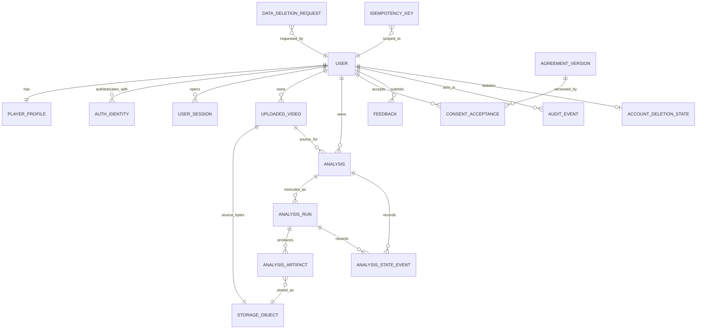

# PostgreSQL-Compatible Data Model

The schema uses UUID primary keys generated application-side or with PostgreSQL
`gen_random_uuid()`, UTC `timestamptz`, and lowercase string enums implemented as
PostgreSQL enums or validated `varchar` columns. Phase 1.8B should choose one enum
migration convention and use it consistently.

## Entity classification

| Entity | Classification | Decision |
| --- | --- | --- |
| User, PlayerProfile, UploadedVideo, Analysis, AnalysisRun | Core domain | Required |
| AnalysisArtifact, AnalysisStateEvent | Core evidence/provenance | Required |
| AuthIdentity, UserSession, verification/reset tokens | Auth infrastructure | Schema reserved; implemented in 1.8C |
| StorageObject | Storage infrastructure | Metadata required in 1.8B; provider implementation in 1.8D |
| IdempotencyKey, AuditEvent | Correctness/security infrastructure | Required |
| AgreementVersion, ConsentAcceptance | Compliance evidence | Required before uploads |
| Feedback | Product domain | Small required table before alpha feedback endpoint |
| DataDeletionRequest, AccountDeletionState | Lifecycle infrastructure | Required before destructive flows |
| AlphaRegistrationRule | Temporary registration policy | Optional table, recommended |
| Analysis History, Play History | Derived projections | No editable tables |
| SubscriptionAccount/BillingProfile | Future placeholder | No table now; reserve no plan columns |
| SharedMatch, MatchParticipant, ResourceShare | Future sharing | Deferred |

Candidate-name mapping: `AuthIdentity` is the provider-neutral identity entity.
`UserCredential` is unnecessary with managed authentication and becomes a separate
table only if self-managed password hashing is later selected. `UserSession`,
`EmailVerificationToken`, and `PasswordResetToken` are infrastructure entities
implemented by Court4 or its managed provider with the lifecycle semantics below.
`SubscriptionAccount` and `BillingProfile` are intentionally deferred rather than
empty placeholder tables.

## Mermaid relationship diagram

## Core tables

### `users`

| Column | Type | Rules |
| --- | --- | --- |
| `id` | uuid | PK |
| `email_normalized` | varchar(320) | not null, unique; Unicode normalization plus lowercase performed by one application function |
| `email_display` | varchar(320) | not null |
| `account_status` | user_status | not null, default `pending_verification`; `pending_verification`, `active`, `disabled`, `suspended`, `deletion_pending`, `deleted` |
| `email_verified_at` | timestamptz | nullable |
| `registration_source` | varchar(32) | not null, default `public`; e.g. `alpha_allowlist` |
| `created_at`, `updated_at` | timestamptz | not null |
| `disabled_at`, `suspended_at`, `deletion_requested_at`, `deleted_at` | timestamptz | nullable |
| `row_version` | bigint | not null, default 1, check > 0 |

Indexes: unique `email_normalized`; `(account_status, created_at)` for admin workflows.
Email may be tombstoned on completed deletion according to the approved re-registration
policy. Status timestamps must agree with status through service invariants.

### `player_profiles`

`user_id uuid` PK/FK to users with cascade on final hard deletion; optional
`display_name varchar(80)`, `dominant_hand varchar(16)`, `experience_level
varchar(32)`, `profile_image_storage_object_id uuid`, `settings jsonb not null
default '{}'`, `profile_schema_version integer not null default 1`, timestamps,
`row_version bigint`. `settings` is for low-risk presentation preferences only;
security, plan, and policy values require columns/tables.

### `uploaded_videos`

| Column | Type | Rules |
| --- | --- | --- |
| `id` | uuid | PK |
| `owner_user_id` | uuid | not null FK users; indexed |
| `source_storage_object_id` | uuid | unique, nullable until upload completes |
| `status` | upload_status | `initiated`, `uploading`, `uploaded`, `validation_failed`, `abandoned`, `deletion_pending`, `deleted` |
| `original_filename` | varchar(512) | not null; display only, never used as object key |
| `media_type` | varchar(255) | nullable until known |
| `declared_size_bytes`, `verified_size_bytes` | bigint | nullable, check >= 0 |
| `sha256` | char(64) | nullable until verified, lowercase hex check |
| `duration_seconds` | numeric(12,3) | nullable, check >= 0 |
| `width_pixels`, `height_pixels` | integer | nullable, check > 0 |
| `fps` | numeric(10,4) | nullable, check > 0 |
| `validation_result` | jsonb | not null default `{}`; versioned inspection snapshot |
| `upload_schema_version` | integer | not null default 1 |
| `retention_expires_at` | timestamptz | nullable |
| `created_at`, `upload_completed_at`, `validated_at`, `updated_at`, `deleted_at` | timestamptz | appropriate nullability |
| `row_version` | bigint | not null default 1 |

Indexes: `(owner_user_id, created_at desc)`, `(status, updated_at)`,
`(sha256, verified_size_bytes)` for duplicate warnings, not global deduplication.
Bytes must never be shared across users merely because hashes match.

### `analyses`

`id uuid` PK; `owner_user_id uuid not null`; `uploaded_video_id uuid not null`;
`status analysis_status not null`; `current_run_id uuid nullable`; `title
varchar(160) nullable`; `subject_kind varchar(32) not null default 'owner'`;
`analysis_schema_version integer not null`; `request_fingerprint char(64) not null`;
`created_at`, `updated_at`, `completed_at`, `failed_at`, `cancelled_at`,
`deletion_requested_at`, `deleted_at`; `superseded_by_analysis_id uuid nullable`;
`row_version bigint not null default 1`.

Constraints:

- unique `(id, owner_user_id)` and unique `(uploaded_video_id, owner_user_id)` on the
  referenced side support composite ownership FKs;
- composite FK `(uploaded_video_id, owner_user_id)` to
  `uploaded_videos(id, owner_user_id)`;
- self-FK `superseded_by_analysis_id`, no cascade;
- status is `created`, `queued`, `processing`, `completed`, `failed`, `cancelled`,
  `deletion_pending`, or `deleted`;
- partial unique `(owner_user_id, uploaded_video_id, request_fingerprint)` while
  status is `created`, `queued`, or `processing` prevents duplicate active analyses.

Indexes: `(owner_user_id, created_at desc)` for Analysis History,
`(owner_user_id, status, created_at desc)`, and `uploaded_video_id`.

### `analysis_runs`

Each processing attempt/reprocessing result is immutable after terminal status.

Columns: `id uuid` PK; `analysis_id uuid not null`; `run_number integer not null`;
`status run_status not null`; `trigger_kind varchar(32)` (`initial`, `retry`,
`reprocess`, `admin_repair`); `reprocessed_from_run_id uuid nullable`;
`idempotency_key_id uuid nullable`; `claimed_by varchar(128) nullable`;
`lease_expires_at`, `heartbeat_at`; `created_at`, `queued_at`, `started_at`,
`completed_at`, `failed_at`, `cancelled_at`; `failure_code varchar(64)`,
`failure_detail_safe text`; `row_version bigint not null default 1`.

Immutable provenance columns:

- `analysis_schema_version integer`;
- `pipeline_version varchar(64)`;
- `policy_bundle_version varchar(64)`;
- `recording_quality_policy_version varchar(64)`;
- `evidence_policy_version varchar(64)`;
- `contribution_policy_version varchar(64)`;
- `comparability_policy_version varchar(64)`;
- `trend_policy_version varchar(64)`;
- `interpretation_policy_version varchar(64)`;
- `detector_model_version varchar(128)`;
- `detector_model_sha256 char(64)`;
- `tracker_version varchar(128)`;
- `court_detection_version varchar(64)`;
- `calibration_version varchar(64)`;
- `configuration_fingerprint char(64)`;
- `source_video_sha256 char(64)`;
- `software_commit_sha varchar(64)`;
- `deployment_build_id varchar(128)`;
- `provenance_json jsonb not null default '{}'`.

Unique `(analysis_id, run_number)`. Partial unique `(analysis_id)` for statuses
`queued` or `processing` permits only one active run. Index `(status,
lease_expires_at)` supports stale-run recovery. `analyses.current_run_id` is added as
a deferrable FK after both tables exist and may reference only a run of that analysis,
enforced with composite uniqueness `(id, analysis_id)`.

### `analysis_state_events`

Append-only audit of domain transitions: `id uuid` PK; `analysis_id uuid not null`;
`analysis_run_id uuid nullable`; `sequence_number bigint not null`;
`from_status varchar(32) nullable`; `to_status varchar(32) not null`; `stage
varchar(64) nullable`; `reason_code varchar(64)`; `actor_type actor_type not null`;
`actor_user_id uuid nullable`; `actor_identifier varchar(128) nullable`;
`request_id varchar(128) nullable`; `metadata jsonb not null default '{}'`;
`created_at timestamptz not null`.

Unique `(analysis_id, sequence_number)` and index `(analysis_run_id, created_at)`.
Events do not replace current-state columns; they explain them.

## Storage and artifact tables

### `storage_objects`

`id uuid` PK; `owner_user_id uuid not null`; `provider varchar(32)`; `bucket
varchar(128)`; `object_key varchar(1024)`; `object_version varchar(256) nullable`;
`category storage_category`; `status storage_status` (`reserved`, `uploading`,
`available`, `quarantined`, `deletion_pending`, `deleted`, `orphaned`);
`media_type varchar(255)`; `size_bytes bigint`; `sha256 char(64)`; `etag
varchar(256)`; `encryption_key_ref varchar(256) nullable`; `created_at`,
`available_at`, `retention_expires_at`, `deletion_requested_at`, `deleted_at`;
`row_version bigint`.

Unique `(provider, bucket, object_key, object_version)` and unique active object key
when provider lacks versions. Indexes on `(owner_user_id, category, created_at)` and
`(status, retention_expires_at)`. Object keys contain opaque IDs, never email or
original filename.

### `analysis_artifacts`

`id uuid` PK; `analysis_id uuid not null`; `analysis_run_id uuid not null`;
`storage_object_id uuid not null unique`; `artifact_category varchar(64)`;
`logical_name varchar(128)`; `schema_version varchar(64) nullable`; `sha256 char(64)
not null`; `media_type varchar(255)`; `size_bytes bigint`; `created_at`; `committed_at`;
`supersedes_artifact_id uuid nullable`; `deleted_at`.

Unique `(analysis_run_id, artifact_category, logical_name)` and indexes on
`analysis_id` and `analysis_run_id`. Artifact ownership is derived from Analysis and
must equal `StorageObject.owner_user_id`; repository code checks it in the same
transaction.

## Identity and lifecycle infrastructure

### `auth_identities`

`id uuid` PK; `user_id uuid not null`; `provider varchar(32)` (`password`, later
`google`, `apple`); `provider_subject varchar(255) not null`; `provider_email
varchar(320) nullable`; `created_at`, `last_authenticated_at`, `disabled_at`.
Unique `(provider, provider_subject)` and `(user_id, provider)` for one identity per
provider. Password hashes remain with the managed provider. If self-managed auth is
chosen, a separate `user_credentials(user_id PK, password_hash, password_changed_at,
hash_algorithm_version)` is required; do not overload this table.

### `user_sessions`

`id uuid` PK; `user_id`, `auth_identity_id`; `provider_session_id_hash char(64)
unique`; `created_at`, `last_seen_at`, `expires_at`, `revoked_at`; `revocation_reason
varchar(64)`; `ip_prefix inet nullable`; `user_agent_hash char(64) nullable`.
Never store access or refresh tokens. Expired/revoked rows are retained briefly for
security investigation, then hard-deleted.

### Verification and reset tokens

`email_verification_tokens` and `password_reset_tokens` contain `id uuid`, `user_id`,
`token_hash char(64) unique`, `created_at`, `expires_at`, `consumed_at`, and
`invalidated_at`. Reset tokens also include `requested_email_normalized` only when
needed for audit. Raw tokens are never persisted. With managed auth these tables may
be provider-owned; the lifecycle semantics remain mandatory.

### Registration, deletion, and idempotency

- `alpha_registration_rules`: `id`, `rule_type` (`approved_email`,
  `registration_enabled`), `value_hash`/normalized email, enabled and expiry fields,
  creator, timestamps. No shared alpha code in the recommended design.
- `idempotency_keys`: `id`, `user_id`, `scope`, `key_hash`, `request_fingerprint`,
  `status` (`in_progress`, `completed`, `failed_retryable`, `failed_final`),
  `resource_type`, `resource_id`, stored response status/body hash, timestamps and
  expiry. Unique `(user_id, scope, key_hash)`.
- `data_deletion_requests`: target type/ID, requester, status, reason, hold fields,
  scheduled/completed timestamps, failure metadata.
- `account_deletion_states`: one row per user with status, confirmation,
  scheduled purge, hold, completion, and reconciliation metadata.

## Consent, feedback, and audit

`agreement_versions` stores immutable `agreement_type`, semantic version, content
hash, effective/retired timestamps, and required purpose categories.

`consent_acceptances` stores user, agreement version, purpose category, accepted
timestamp, withdrawal timestamp, acceptance source, IP prefix/user-agent hash where
approved, and optional upload ID. Unique active acceptance is enforced in service
logic because withdrawal changes validity over time.

`feedback` stores owner, optional analysis/run, category, text, status, created and
resolved timestamps. It must not become a pipeline result source.

`audit_events` records security-relevant actions with actor type/user, action,
resource type/ID, outcome, request ID, safe metadata, and timestamp. It must never
contain tokens, raw videos, password material, or full sensitive request bodies.

## Deletion behavior

Database FKs default to `RESTRICT`. User hard deletion is performed only by the
account-deletion orchestrator after child resources and storage objects are
reconciled. Evidence rows are soft-deleted first. Tokens and sessions may cascade
only at final user purge. Analyses never cascade-delete uploaded videos because one
video may have multiple reprocess analyses. Storage deletion is explicit and
auditable, not an FK side effect.

## Future compatibility without placeholder tables

Subscriptions later attach to `users.id` through `subscription_accounts`; quotas
are evaluated by a plan service and usage aggregates, not columns on users. Sharing
later adds grants/participants referencing existing video and analysis IDs. Multiple
sports later add `sport_type` and sport-specific version bundles without changing
ownership. No Phase 1.8A table is needed for these deferred concepts.
