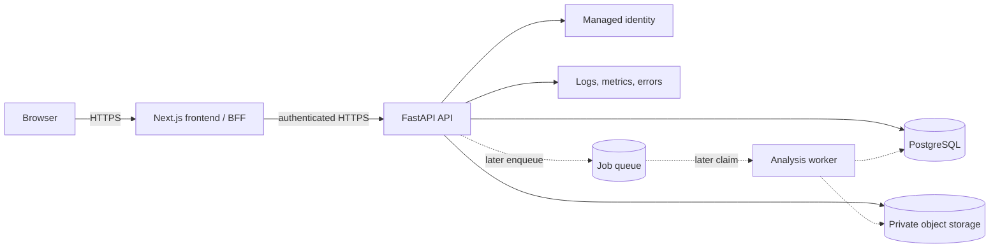

# Deployment Architecture

## Target topology

The frontend and API may share one public domain through a reverse proxy to simplify
cookies, CORS, and CSRF boundaries. PostgreSQL, object storage, provider management,
and internal endpoints are not public.

## Private-alpha minimum

- managed Next.js hosting or a containerized Next.js service;
- one hardened FastAPI Docker service;
- managed PostgreSQL with encrypted backups and point-in-time recovery where
  affordable;
- private object storage;
- managed auth and transactional email;
- HTTPS, secrets manager, production origin allowlist;
- structured centralized logs, error reporting, uptime/health monitoring;
- one production and one non-production environment;
- tested database restore and object reconciliation;
- synchronous processing initially, but committed as `AnalysisRun` state and executed
  with bounded concurrency.

The API container downloads a source to an isolated, quota-limited scratch directory,
writes temporary outputs there, uploads verified artifacts, and discards scratch.
No durable state depends on the container disk. Use a single processing concurrency
slot initially or a separate execution service to prevent CPU/memory collapse.

## Public-beta additions

- background queue and dedicated autoscalable worker;
- resumable direct uploads and enforced user/plan quotas;
- comprehensive rate limiting and abuse controls;
- automated retention/deletion sweeper;
- alerting SLOs, dependency dashboards, audited admin tooling;
- restore/rollback drills and incident runbooks;
- capacity tests for concurrent uploads and analyses.

## Practical hosting approaches

| Approach | Strengths | Risks | Fit |
| --- | --- | --- | --- |
| Managed frontend + container PaaS + managed Postgres/object storage | Low operations, independent scaling, no Kubernetes | Several vendors/network configuration | Recommended alpha shape |
| One VM with containers plus managed DB/storage | Predictable low cost, easy CPU/GPU access | Patching, single-host availability, manual scaling | Viable controlled alpha |
| Supabase for Auth/Postgres/Storage plus external API compute | Integrated low-cost control plane | Vendor concentration and storage/compute integration constraints | Viable after spike |
| Kubernetes | Flexible | Excess operational cost and complexity | Not required |

No Google Cloud assumption is made. Selection should use region, video egress,
CPU/GPU availability, backup quality, auth requirements, and total cost.

## Configuration and secrets

Runtime secrets come from a platform secret manager, never `.env.example`, image
layers, `NEXT_PUBLIC_*`, or repository files. Separate public build-time values from
server-only API/auth/storage/database settings. Rotate database, storage signing,
email, and identity credentials independently.

CORS is an exact HTTPS origin allowlist. Prefer same-origin BFF calls. Health:

- liveness: process event loop responds, no sensitive detail;
- readiness: protected/internal check of DB and critical configuration;
- worker readiness later: DB/storage access plus model availability.

## Backups and rollback

Database backups and object versioning/lifecycle are coordinated by reconciliation,
not assumed atomic. Each deployment records build ID and migration version. Deploy
schema expansions before code use, then contract old columns only after rollback
windows. Rollback documentation includes compatible app version, database migration
direction, object format, and deletion tombstone replay.

## Future worker boundary

Phase 1.8B stores queued runs, leases, and events even while API executes them.
Adding a queue later changes only the executor:

1. API commits queued run;
2. dispatcher publishes run ID;
3. worker claims DB row (DB remains authority);
4. worker processes storage objects and commits artifacts;
5. duplicate messages are harmless because claims and idempotency are durable.

Queue delivery is at-least-once; exactly-once claims are not assumed.
